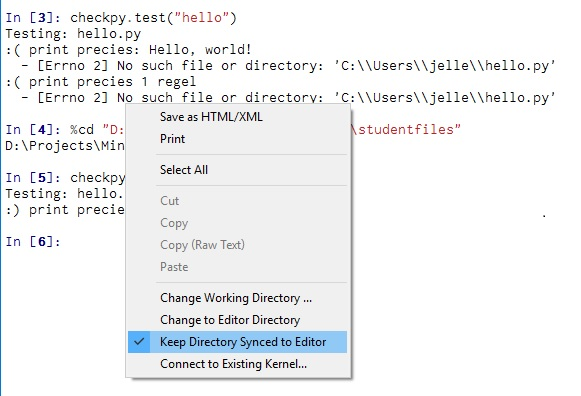

# Hello

## tl;dr
Implementeer een programma dat een simpele begroeting uitprint als volgt:

```
Hello, world!
```

Voor context zie [wikipedia](https://nl.wikipedia.org/wiki/Hello_world_(programma))


## Specification
Tijd om ons eerste programma te schrijven. Maak via de Canopy editor een nieuwe file aan (ctrl+n of cmd+n) en sla deze in een plek naar keuze op als `hello.py` (ctrl+shift+s of cmd+shift+s). Een tip hierbij is om jouw bestanden op te slaan in Dropbox, zo kun je altijd je bestanden terughalen. Plaats in deze file het volgende stukje Python code:

```
print "Hello, world!"
```

Sla nu je bestand op (ctrl+s of cmd+s), en run deze door middel van de run knop bovenin de editor. Als het goed is zie je nu in de Python terminal de tekst `Hello, world!` staan.


## Testing
Test eerst je programma zelf. Staan er bijvoorbeeld geen extra hoofdletters of missende uitroeptekens in het resultaat?

Ben je tevreden? Test je programma dan met checkpy. Dit doe je door de volgende regels Python code uit te voeren in de Python terminal:

```
import checkpy
checkpy.test("hello")
```

Als je alleen maar happy smileys ziet dan slagen de tests, en kun je nu verder met de volgende opdracht. Slagen ze niet, dan is het tijd om te debuggen. Zie je de volgende error "No such file or directory:", probeer dan eens rechts te klikken de in Python terminal en het volgende aan te vinken:



Was dit niet het probleem? Kijk dan nog eens goed naar je code, staat er bijvoorbeeld geen extra spatie ergens? Kom je er niet uit, tik even een assistent aan!